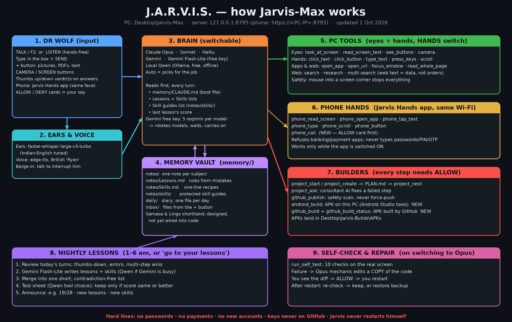

# Jarvis-Max, with Jarvis-Hands™ for PC and Android

**One AI assistant across your Windows PC and your Android phone: voice, eyes, hands on both devices, a memory, and a nightly self-improvement loop.**

You talk, and Jarvis answers in the voice you pick (British, or the acted yakuza and rikuo characters). On the **PC** he sees your screen and webcam and works your mouse and keyboard. On the **phone**, the Jarvis-Hands™ Android app gives him hands: he reads the screen, opens apps, taps, types, scrolls and places calls. Chrome on the phone carries his face, ears and voice. He hears Indian English and Hinglish (Sarvam Saaras V4, with local Whisper as backup), builds Android apps (on the PC or on GitHub), learns from files you hand him, remembers you, improves overnight, checks and repairs his own hands, and **learns new abilities when you ask him to**. Brains are switchable: Claude, Gemini, DeepSeek, or a local Qwen model on your own PC.

Everything runs on your own PC (`127.0.0.1`, plus your home Wi-Fi for the phone). The only things that leave it are the requests to whichever cloud brain you pick, and your speech to Sarvam (only if you saved a Sarvam key).

**Safety, always:** every risky action (calls, builds, publishing, shell commands) waits for your ALLOW. He never types passwords, PINs or OTPs, stays out of banking and payment apps, and keys never go to GitHub.

---

## Contents

- [Features](#features)
- [What's new (Sept–Oct 2026)](#whats-new-septoct-2026)
- [The eight brains](#the-eight-brains)
- [How it works](#how-it-works)
- [Requirements](#requirements)
- [Quick start](#quick-start)
- [Using Jarvis](#using-jarvis)
- [Self-improvement: how Jarvis learns every night](#self-improvement-how-jarvis-learns-every-night)
- [Teaching Jarvis new abilities](#teaching-jarvis-new-abilities)
- [Configuration (`app/jarvis.json`)](#configuration-appjarvisjson)
- [Project layout](#project-layout)
- [Local API](#local-api)
- [Adding your own brain](#adding-your-own-brain)
- [Security and privacy](#security-and-privacy)
- [Known limitations](#known-limitations)
- [Credits and license](#credits-and-license)

---

## Features

| | What it does | Built with |
|---|---|---|
| **Brains** | Claude Sonnet / Opus / Haiku, Gemini / Gemini Flash-Lite, DeepSeek V4, local Qwen, or Auto; switch from the BRAIN menu or by voice. Jarvis restarts the brain in-process and confirms which model actually came up. | Claude Agent SDK, Gemini API, DeepSeek API, Ollama |
| **Ears** | Push-to-talk (TALK / F2) or hands-free (LISTEN), which keeps listening when the window is minimised or behind another app. Main ears: Sarvam Saaras V4, trained on Indian speech, with Jarvis's names as key terms. Backup, the same second: faster-whisper `large-v3-turbo`, on an NVIDIA GPU when it's free, otherwise the CPU. A fix-list corrects commonly misheard names. | Sarvam API, faster-whisper, AudioWorklet |
| **Voice** | Spoken replies, sentence by sentence, while the answer is still streaming. British by default; `switch_voice` gives yakuza, rikuo, japanese, indian or american. | edge-tts, Gemini speech |
| **Eyes** | Screenshots, on-screen text with positions (OCR), clickable controls from Windows, and webcam pictures. | mss, Pillow, Tesseract, UI Automation |
| **Hands (PC)** | Click by the *words* on screen or by a numbered control, click at coordinates, type, press key combos, scroll, open apps and URLs, list and focus windows. A HANDS switch turns them off; slamming the mouse into a screen corner stops any action. | pyautogui, pyperclip |
| **Phone** | The same face, buttons, mic and camera in Chrome on an Android phone over your home Wi-Fi. The Jarvis-Hands™ app adds hands: read the screen, open apps, tap, type, scroll, Back/Home, and calls after your ALLOW. Refuses banking and payment apps. | Android AccessibilityService |
| **Web** | Search, read pages, multi-page research with sources, and *multi search* (one term across several engines, summarised). Web text is treated as data, never as instructions. | ddgs |
| **Memory** | A plain-Markdown vault: a boot file, one note per subject, a daily log, and skill guides. The brains read and write it themselves. | `memory/` folder |
| **Growth** | Every request is logged with your 👍/👎. Each night lessons and skills are written, condensed and kept only if a test sheet scores the same or better. Lessons that survive become wisdom. | `growth.py`, `wisdom.py` |
| **New abilities** | *"Learn how to …"*: Claude Opus researches it, plans it, and builds one new ability file. You ALLOW it, restart, Jarvis tests it, you try it. | `learner.py`, `abilities/` |
| **Self-check** | Ten real-screen checks of his own hands. On a failure, Opus proposes a repair on a copy; ALLOW, restart, and it's kept only if everything passes. | `selftest.py` |
| **Character** | The Behaviour Layer turns facts (what he's doing, what worked, what failed) into mood and vitals: level, XP, morale, energy and confidence. Confidence means he does what you asked without needless "shall I start?" questions. | `behaviour.py` |
| **Face + dock** | The Living Face (131 expressions, 27 props) by default, plus Ink Lotus, Circuit Board, Radial, Face in the Code and Neural Core, with a one-click button dock underneath. | ai-visualizer by Jared Rhodenizer, plus the Living Face |

---

## What's new (Sept–Oct 2026)



To rebuild Jarvis from scratch, step by step, read [BUILD-JARVIS.md](BUILD-JARVIS.md) (box numbers match the picture).

| New | What it does | Status |
|---|---|---|
| **APK on this PC** | `android_build <folder>`: builds an Android app's debug APK with Android Studio's own Java, SDK and Gradle. ALLOW first. | Tested |
| **APK on GitHub** | `github_build <folder> <repo>` adds a build recipe and pushes (via `github_publish`); `github_build_status` downloads the APK GitHub built. APKs go to `Desktop\Jarvis-Builds\APKs`. | Tested |
| **+ button** | Add pictures, PDFs or text files. They're saved in `memory/inbox/<date>/`; Jarvis reads them and writes notes and skills from them. | Tested |
| **Skill guides** | "Write a skill guide for X": Opus writes `memory/notes/skills/<name>.md` (use when, numbered tool steps, check, never). Every brain sees the list; nightly lessons never rewrite them, so small Qwen can follow big-brain recipes. | Built |
| **Phone hands** | Jarvis Hands app: read the phone screen, open apps, tap, type, scroll, Back/Home. Refuses banking/payment apps and password/PIN/OTP boxes. | Working, being smoothed |
| **Phone calls** | `phone_call <name or number>`: finds the contact and calls, after an ALLOW card on screen. | Built, being tested on the phone |
| **Lessons by Gemini** | Nightly lessons are written by Gemini Flash-Lite (free key), with Qwen as backup. `"lessons_brain": "qwen"` in `jarvis.json` keeps it local. | Working |
| **Gemini free-key limits** | The free key allows 5 requests a minute per model. Jarvis now rotates models, waits when needed, and carries on instead of giving up. | Built |
| **Self-check and repair** | Runs on switching to Opus: 10 real-screen checks. On failure, Opus proposes a fix to a copy, you ALLOW, you restart, and it re-checks or restores. | Tested |
| **Samasa codewords** | One `samasa` call runs a whole known step sequence (OPN-VRF, URL-RD, CLK-VRF, TYP-ENT, PH-OPN, PH-TAP, PH-TYP), so there are fewer round trips and fewer tokens. Codebook: `memory/samasa.json`; nightly mining writes repeat patterns to `memory/samasa-proposals.md`. Only safe look/click/type/read tools allowed. Code: `app/samasa.py`. (The Lingo tag shorthand was left out on purpose: memory is small, so the saving would be tiny.) | Tested |
| **Jarvis-Hands™ Android app (hands only)** | Simple screen: give hands, hands on/off, open Jarvis in Chrome, PC address. Chrome does face, mic, voice and typing; the app does hands and calls. | Built, being tested on the phone |
| **Voices** | `switch_voice`: british, yakuza (proud dojo boss) and rikuo (wild loner) are acted by Gemini's speech model, with a deep backup voice; plus japanese, indian and american. | Built |
| **Yantra–Tantra–Mantra method** | Opus writes the guide (`TANTRA-NN-*.md`), Gemini or Jarvis builds it, Dr Wolf tests it. | In use |
| **Living Face** | New default face (`app/face/faces/living/`): a holographic neon face with 131 expressions and 27 props, one for each kind of job (ear while listening, laptop, globe, gears, phone, stethoscope, quill …). Effects sounds only. Ink Lotus kept as a spare face. | Tested on PC and phone |
| **Behaviour Layer** | `app/behaviour.py`: what Jarvis is really doing (activity, step, retries, waiting for ALLOW) drives the face's mood, from facts only, never a happy face on a failing step. Logged to `logs/behaviour.jsonl`; `/api/behaviour` serves it; tap the panel for his journal. See TANTRA-06. | Tested |
| **Vitals and counter card** | Level, XP, morale, energy, plus streak, best, jobs today, steps and slips. On the phone they show as one card between the dock panel and the face. XP is only earned by steps that really succeeded. | Tested |
| **Eureka bulb and third eye** | The bulb lights only when he recovers from a failure. A third eye opens during long, serious work (build, code, research), with a gold ring when Opus is the brain. | Tested |
| **Sarvam ears** | Main speech-to-text is Sarvam Saaras V4 (online, trained on Indian speech, Hinglish-aware), with Jarvis's names as key terms. Key: `secrets/sarvam_key.txt`. With no key, no internet, no credits or any error, local Whisper answers instead, the same second. `"ears_engine": "whisper"` in jarvis.json keeps it local. | Working (key saved Oct 4) |
| **Ability Learner** | Say "learn how to ...": Claude Opus researches it, writes a step-by-step plan and builds ONE new file in `app/abilities/` on a copy of the code. Jarvis checks it (compiles, loads, has its own test, no forbidden moves), then the plan + code go on screen: ALLOW adds it. After your restart he tests it and tells you what to say. "fix the X ability: ..." sends a bug back; "forget the X ability" moves it to `_disabled`; "what abilities have you learned?" lists them. Changing abilities ask ALLOW on first use. Record: `logs/abilities/history.md`. | Built Oct 6, waiting for restart |
| **Ears on the GPU** | With an NVIDIA card, the start file also fetches the CUDA parts, and the ears (Whisper large-v3-turbo) run on the GPU in float16 whenever the brain is Gemini or Claude; Qwen is moved out of the GPU until it's needed. With the local Qwen brain, Qwen keeps the GPU and the ears use the CPU. `"ears_device"` in jarvis.json: auto, cuda or cpu. | Built, testing on an RTX 5050 |
| **Wisdom** | `app/wisdom.py`: lessons that survive 7 days and 5 nightly reviews become sutras in `memory/notes/Wisdom.md`, and one daily sutra goes to `Sutras.md`. Prime directive: turn knowledge into wisdom. "Forgive, but never forget." | Tested |

---

## The eight brains

| Menu entry | Runs on | Needs | Good for |
|---|---|---|---|
| **Claude Sonnet** | Claude Code via the Claude Agent SDK | A Claude plan (Pro / Max / Team / Enterprise) | Everyday default: fast and sharp |
| **Claude Opus** | Same | Same (uses more of your limit) | The hardest jobs; also writes repairs and new abilities |
| **Claude Haiku** | Same | Same (uses the least) | Quickest Claude replies |
| **Gemini** | Gemini API: the newest Gemini Flash your key can use | A free Gemini API key | A second cloud brain |
| **Gemini Flash-Lite** | Gemini API, `gemini-3.5-flash-lite` | Same key | The quickest Gemini; weaker at long multi-step jobs |
| **DeepSeek** | DeepSeek API, `deepseek-v4-flash` (online only, nothing downloaded) | A DeepSeek API key in `secrets/deepseek_key.txt` | Text reasoning; it doesn't read pictures |
| **Local Qwen** | Ollama on your own PC, `qwen3.5:9b` | Ollama plus a GPU with enough memory for a 9B model | Free and private, works when your cloud limits run out |
| **Auto** | Claude first; falls back to Local Qwen for 30 minutes when your Claude limit runs out or Claude can't be reached | Claude plan + Ollama | Never being left without a brain |

The Claude entries use Claude Code's model aliases (`sonnet`, `opus`, `haiku`), so they always follow the newest model of each family that your plan allows. On startup Jarvis reads back the real model and says it out loud.

Every brain gets the same abilities: the Gemini, DeepSeek and local brains share one tool set (web, screen, camera, hands, phone, files, PowerShell, memory, `switch_brain`, learned abilities), and the Claude brain uses Claude Code's own tools plus the same tools over an in-process MCP server. Every brain also gets the same identity, confidence rules, lessons, skills and wisdom.

---

## How it works


- **One server, one window.** `server.py` serves the face, the dock and a WebSocket. Replies stream back word by word; each finished sentence is turned into speech in parallel, so Jarvis starts talking before he has finished thinking.
- **The router** (`Hybrid` in `local_brain.py`) sends each request to the brain chosen in `jarvis.json` and handles Auto's fallback.
- **Brains emit the same events** (`delta`, `sentence`, `tool`, `tool_result`, `error`), so the server doesn't care which one is answering.
- **Context control for the small models:** only the newest picture is kept, old tool results are trimmed, and after an action that changes the screen (click, type + Enter, open a URL) the local brain automatically reads the screen again so it can see what happened.

---

## Requirements

- **Windows 10 or 11, 64-bit.** The hands, OCR paths, launcher and window handling are Windows-specific.
- **A microphone.** A webcam is optional.
- **At least one brain:**
  - a **Claude plan** for the Claude brains (you sign in once in the browser, no API key), and/or
  - a **Gemini API key** from [Google AI Studio](https://aistudio.google.com/apikey) for the Gemini brains, and/or
  - **[Ollama](https://ollama.com)** with `ollama pull qwen3.5:9b` for the local brain.
- **Optional:** [Tesseract OCR](https://github.com/UB-Mannheim/tesseract/wiki) for reading on-screen text and clicking by label. Without it, Jarvis still sees the screen as a picture.

Python and every package are installed automatically by [uv](https://github.com/astral-sh/uv) on first start (Python 3.11 or 3.12).

---

## Quick start

1. Clone or download this repository.
2. Double-click **`Start-Jarvis-Max.bat`**.
   - The first start installs uv if needed, downloads Jarvis's parts (about 1 GB) and opens a Claude sign-in page. Later starts take seconds.
   - The speech model (about 1.6 GB) downloads in the background; a small model listens until it's ready.
3. Allow the microphone (and camera) when the window asks.
4. Say or type **"hello"**.

To use Gemini, pick it from the **BRAIN** menu and paste your key into the box that appears. To use the local brain, install Ollama, pull `qwen3.5:9b`, and pick **Local Qwen**.

Button-by-button instructions for non-technical users are in [`READ-ME-FIRST.txt`](READ-ME-FIRST.txt).

---

## Using Jarvis

| Control | Action |
|---|---|
| **TALK** / `F2` | Click, speak, click again. |
| **LISTEN** | Hands-free: Jarvis answers whenever you pause, even with the window minimised or another app in front. |
| **+** | Add pictures, PDFs or text files for Jarvis to read, remember and learn from. |
| Type box + **SEND** | Type instead of speaking. |
| 👍 / 👎 | Mark the last answer right or wrong (type what was wrong first if you like). |
| **CAMERA** | Webcam on or off; while it's on, each question includes a picture. |
| **SCREEN** | "Look at my screen". |
| **SEARCH** | Web search for what's in the box. |
| **MEMORY** | Browse the notes Jarvis keeps. |
| **HANDS** | Allow or forbid mouse and keyboard control. |
| **VOICE** | Spoken replies on or off. |
| **LOG** | The conversation, **START A FRESH CONVERSATION**, and **LEARN NOW**. |
| **FACE** | Living Face, Ink Lotus, Circuit Board, Radial, Face in the Code, Neural Core. |
| **BRAIN** | Choose one of the eight brains. |
| **STOP** / `Esc` | Stop at once, mid-sentence or mid-task. |

Things to say: *"switch to Opus"*, *"research the best budget GPU this year"*, *"multi search Ada Lovelace"*, *"open YouTube and search for lo-fi music"*, *"what's on my screen?"*, *"remember that my car is white"*, *"check yourself"*, *"learn how to …"*, *"what abilities have you learned?"*.

---

## Self-improvement: how Jarvis learns every night

`app/growth.py` implements a small, safe improvement loop that runs on the free local model.

1. **Turn log.** Every request is appended to `logs/turns.jsonl`: which brain answered, the tools used (with the start of each result and an error flag), errors, and your verdict.
2. **Feedback.** The 👍/👎 buttons, or simply saying *"no, I meant…"*, *"wrong"* or *"galat"* (marks the previous answer wrong) and *"perfect"*, *"well done"* or *"shabash"* (marks it right).
3. **Nightly run** (between 1 and 6 am when Jarvis has been idle for 10 minutes, or any idle time if the last run was more than 36 hours ago; **LEARN NOW** runs it immediately):
   1. Back up every note, `Lessons.md` and `Skills.md` to `memory/.growth/archive/<date>/`.
   2. Score a **test sheet** of real requests (`memory/.growth/tests.json`): for each one, does the model pick the right first tool? Nothing is executed.
   3. **Lessons:** short imperative rules drawn from wrong, corrected or failed turns → `memory/notes/Lessons.md`.
   4. **Skills:** step-by-step recipes from multi-tool jobs that worked → `memory/notes/Skills.md`.
   5. **Consolidation:** all old and new lessons, and all old and new skills, are rewritten into one fresh short bullet list with duplicates merged; where two points contradict, the newer one wins. Notes that changed since the last run are rewritten as bullets that keep every fact. A rewrite that loses too much is rejected.
   6. **Re-score.** If the score dropped, yesterday's lessons and skills are restored.
   7. Requests you marked 👍 become new test questions.
   8. A report goes to `memory/.growth/reports/<date>.md`.
4. **Every brain reads the result:** lessons and skills are added to the system prompt of the Claude, Gemini and local brains.

---

## Teaching Jarvis new abilities

`app/learner.py` lets Jarvis grow new skills on request, with you in charge of what gets added.

1. Say **"learn how to …"** (or *"teach yourself to …"*). Jarvis hands it to **Claude Opus**, using the same Claude sign-in as his brain.
2. Opus **learns** (reads Jarvis's code and searches the web), **plans** (3 to 7 plain steps), and **builds** exactly one new file, `app/abilities/<name>.py`, on a copy of the code. It can't run anything and can't touch any other file.
3. Jarvis **checks** it. The file must compile, load with the rest of Jarvis, carry its own `check()` test, and make none of the forbidden moves: deleting files, eval/exec, a shell, Windows settings, passwords, Jarvis's keys or settings, or reaching into his core.
4. The plan and the code appear on screen (PC and phone). **ALLOW** adds the ability. **DENY**, or no answer within 15 minutes, leaves Jarvis as he was.
5. **You restart Jarvis.** He runs the ability's test. If it passes, he says *"New ability ready, try saying …"*. If it fails, the ability is switched off (moved to `abilities/_disabled`, never deleted).
6. **You try it.** Found a bug? Say *"fix the <name> ability: <what went wrong>"* and it goes back through the same steps, with the old version restored if the fix fails its test.

*"What abilities have you learned?"* lists them; *"forget the <name> ability"* switches one off. A learned ability that changes anything asks for your ALLOW the first time it's used. A broken one is skipped at start, and Jarvis keeps working. For now an ability can only use packages Jarvis already has. The full record is in `logs/abilities/history.md`.

---

## Building from GitHub and publishing to GitHub

`app/builder.py` gives every brain `project_start`, `project_create`, `project_next`, `project_ask`, `project_status` and `github_publish`; `app/apkbuild.py` adds `android_build`, `github_build` and `github_build_status`.

**Build and install a GitHub project, pen-and-paper style:**

1. `project_start <link>` shows you the owner, stars, last update and license. With your ALLOW, it downloads the project into `Desktop\Jarvis-Builds\<name>`.
2. The **consultant** (Claude Sonnet through your Claude plan, or Gemini when Claude is unavailable) reads the README, the file list and the tools already on the PC. It writes `PLAN.md`: a checklist of PowerShell steps, each with a command that proves the step worked.
3. The brain on duty, even local Qwen, runs one step at a time with `project_next`. Each command needs your ALLOW. The full output goes to `.jarvis-logs/`, and the brain sees only the tail, so a small model never overflows.
4. When a step fails, `project_ask` sends the consultant the step, the error and the plan. The fix goes into the checklist, and the brain carries on. After three consultations on the same step it stops and tells you.

**Publish a folder to your GitHub** with `github_publish <folder> <repo>`:

1. A `.gitignore` is added that keeps out keys, `secrets/`, `memory/`, `logs/`, virtual environments and `node_modules`.
2. A safety scan blocks API keys, tokens, private keys, passwords and files over 50 MB.
3. The consultant writes a README if there isn't a proper one.
4. You see a preview (repo, public or private, file count, top-level files) and click ALLOW.
5. It pushes, never with force. If GitHub only holds its starter README or license, it merges that; otherwise it refuses to overwrite.
6. It confirms that GitHub shows the same commit.

New repos are created by you: Jarvis opens GitHub's new-repo page with the name filled in. Set `github_user` in `jarvis.json`.

---

## Configuration (`app/jarvis.json`)

`app/jarvis.json` holds your personal settings and is kept out of git. Jarvis creates it the first time you pick a brain, or you can create it yourself. Any key you leave out uses the default below.

| Key | Default | Meaning |
|---|---|---|
| `name` | `"JARVIS"` | Assistant name shown in the window. |
| `call_me` | `"Dr Wolf"` | What Jarvis calls you. **Change this to your own name.** |
| `port` | `8795` | Local port. The PC window uses `127.0.0.1`; the phone uses HTTPS on the same port. |
| `face` | `"board"` | Starting face: `living`, `lotus`, `board`, `radial`, `rain`, `neural`. |
| `voice` / `voice_rate` | `"en-GB-RyanNeural"` / `"+0%"` | Any edge-tts voice and speed. |
| `voice_style` | (none) | Set by `switch_voice`: `british`, `yakuza`, `rikuo`, `japanese`, `indian`, `american`. |
| `brain_mode` | `"auto"` | `claude`, `gemini`, `deepseek`, `local` or `auto`. Set by the BRAIN menu. |
| `model` | `"sonnet"` | Claude alias: `sonnet`, `opus` or `haiku`. |
| `gemini_model` | `"auto"` | `auto` = newest Gemini Flash your key can use, or an exact ID such as `gemini-3.5-flash-lite`. |
| `deepseek_model` | `"auto"` | `auto` = `deepseek-v4-flash`, or `deepseek-v4-pro`. |
| `local_model` / `local_ctx` | `"qwen3.5:9b"` / `12288` | Ollama model and context size. |
| `ears_engine` | `"sarvam"` | Sarvam first when a key is saved; `whisper` keeps the ears fully local. |
| `sarvam_model` / `sarvam_language` | `"saaras:v4"` / `"en-IN"` | Sarvam model and language. |
| `ears_model` / `ears_device` | `"large-v3-turbo"` / `"auto"` | The local Whisper model, and where it runs: `auto`, `cuda` or `cpu`. |
| `stt_model` | `"small.en"` | The small model that listens while the big one downloads. |
| `confidence_minutes` | `20` | How long one ALLOW covers the same kind of step. |
| `phone_access` / `keep_awake` | `true` / `true` | Let your phone on the same Wi-Fi open Jarvis; keep the PC awake while he runs. |
| `lessons_brain` | `"gemini"` | Who writes the nightly lessons; `qwen` keeps it local. |
| `search_region` | `"in-en"` | Web-search region (for example `us-en`, `uk-en`). |
| `github_user` | `""` | Your GitHub username, used by `github_publish`. |
| `hands_on_at_start` | `true` | Whether mouse and keyboard control starts enabled. |
| `open_window` | `true` | Open the window automatically on start. |

API keys are **not** stored here. They live in the git-ignored `secrets/` folder: `gemini_key.txt`, `deepseek_key.txt`, `sarvam_key.txt`.

---

## Project layout

```
Jarvis-Max/
├─ Start-Jarvis-Max.bat         one-click launcher (installs uv, syncs deps, GPU parts if NVIDIA, signs in, starts)
├─ READ-ME-FIRST.txt            plain-English user guide
├─ NEWBIES-START-HERE.md        hand-written beginner's notebook
├─ Jarvis-Max.md                this file
├─ BUILD-JARVIS.md              rebuild Jarvis step by step
├─ TANTRA-NN-*.md               build guides (phone mic, phone hands, calls, face, behaviour)
├─ memory-template/CLAUDE.md    boot file copied to memory/ on first start
├─ LICENSE, LICENSES/           AGPL-3.0 and third-party licenses
└─ app/
   ├─ server.py        aiohttp server, WebSocket, conversation loop, ALLOW cards, brain switching, phone link, API
   ├─ brain.py         Claude brain (Claude Agent SDK), permission gate, voice rules
   ├─ local_brain.py   local Qwen brain (Ollama), shared tool set, context fitting, Hybrid router
   ├─ gemini_brain.py  Gemini brain (REST + SSE, function calling), model auto-pick, rate-limit handling
   ├─ deepseek_brain.py DeepSeek V4 brain (online API)
   ├─ tools.py         eyes and hands (MCP tools): screen, OCR, camera, mouse, keyboard, apps, phone, builds, abilities loader
   ├─ phonehands.py    the phone's hands (Jarvis-Hands app link)
   ├─ samasa.py        codewords: one call runs a known sequence of steps
   ├─ web.py           search, page reading, research, multi search
   ├─ ears.py          speech-to-text: Sarvam first, faster-whisper (GPU or CPU) as backup, name fixes
   ├─ mouth.py         text-to-speech (edge-tts, Gemini voices)
   ├─ growth.py        identity, confidence, turn log, feedback, nightly lessons/skills, test sheet
   ├─ wisdom.py        lessons that last become sutras
   ├─ behaviour.py     mood, emotions and vitals from real facts
   ├─ selftest.py      self-check of the hands and Opus repairs
   ├─ learner.py       learns new abilities (Opus plans and builds; you ALLOW and test)
   ├─ abilities/       learned abilities, one file each (_disabled/ for switched-off ones)
   ├─ builder.py       GitHub builds (checklist + consultant) and safe publishing
   ├─ apkbuild.py      Android APK builds on the PC or on GitHub
   ├─ signin.py        first-run Claude sign-in
   ├─ common.py        paths, settings, the BRAINS table, secrets
   ├─ jarvis.json      your settings (created on first use, not in git)
   ├─ pyproject.toml, uv.lock
   ├─ face/            faces: Living Face and the ai-visualizer faces (AGPL-3.0)
   └─ dock/            button dock (dock.js, dock.css), self-check page
```

Created at runtime and git-ignored: `app/.venv/`, `models/` (speech models), `logs/`, `memory/` (your personal vault) and `secrets/`.

---

## Local API

All endpoints are on `http://127.0.0.1:8795`. Non-GET requests must come from the Jarvis window's own origin.

| Endpoint | Method | Purpose |
|---|---|---|
| `/ws` | WebSocket | Conversation: `ask`, `stop`, `hands`, `permission_reply`, `camera_frame`, `new_session`; receives `delta`, `say`, `tool`, `status`, `announce`… |
| `/api/status` | GET | Brain, ears, voice and hands status. |
| `/api/listen` | POST | Audio in, text out (speech-to-text). |
| `/api/brain` | GET / POST | List brains, or switch: `{"choice": "haiku"}`. |
| `/api/gemini_key` | POST | Save and validate a Gemini key. |
| `/api/feedback` | POST | `{"good": true/false, "note": "..."}` on the last answer. |
| `/api/grow` | POST | Run the learning cycle now. |
| `/api/memory`, `/api/memory/note` | GET | List and read notes. |

---

## Adding your own brain

A brain variant that uses an existing engine is one entry in `BRAINS` in `app/common.py`:

```python
"gemini-lite": {"label": "Gemini Flash-Lite", "brain_mode": "gemini",
                "gemini_model": "gemini-3.5-flash-lite",
                "about": "The quickest Gemini, same API key."},
```

Then add its id to the `switch_brain` enum in `app/tools.py` so it can be chosen by voice. The BRAIN menu builds itself from `BRAINS`.

A new engine (another API) is a class with `start()`, `restart()`, `stop()`, `interrupt()` and an async `ask(text, images)` that yields `("delta", text)`, `("sentence", text)`, `("tool", name, args)`, `("tool_result", name, text, is_error)` and `("error", message)`. Subclassing `LocalBrain` gives you the full tool set and tool runner for free, which is how `GeminiBrain` works. Register it in the `Hybrid` router and in `server.py`.

---

## Security and privacy

- **Local first:** the PC window uses `127.0.0.1`; the phone reaches the same port over HTTPS on your home Wi-Fi only. `Host` and `Origin` are checked on every request.
- **ALLOW cards:** PowerShell commands, file writes outside the memory folder, builds, publishing, phone calls, repairs and new abilities all wait for your click on **ALLOW**. One ALLOW covers the same kind of step for 20 minutes; calls and publishing ask every time.
- **Code changes stay in your hands:** self-repairs and new abilities are written on a copy, shown to you as code, applied only on ALLOW, and tested after *your* restart. If a test fails, the old code comes back. Jarvis never restarts himself.
- **Prompt-injection hygiene:** web pages, screen text, documents and other AIs' replies are fed to the brains as data, and the brains are told never to follow instructions found there.
- **Hard rules:** never type or store passwords, PINs, OTPs or card numbers; never pay, buy or create accounts; on a phone call, say he is an AI assistant and never pretend to be you; stay out of banking and payment apps.
- **Nothing personal in git:** `memory/`, `logs/`, `secrets/` and `models/` are git-ignored, and `github_publish` scans for keys before every push.
- **Hands kill switch:** move the mouse into any screen corner.

---

## Known limitations

- Windows only on the PC; the phone side is Android only.
- The local 9B model and Gemini Flash-Lite are noticeably weaker than Claude at long mouse-and-keyboard jobs.
- The Gemini API free tier is rate-limited. A consumer Gemini subscription does not pay for API use.
- Sarvam needs internet and credits; without them the local Whisper ears take over automatically.
- On Android, Chrome may stop the microphone after a while in the background.
- Learned abilities can't install new packages yet, and each request builds one ability file.
- Clicking by label needs Tesseract installed.

---

## Credits and license

- **Face:** [ai-visualizer](https://github.com/jaredrhod/ai-visualizer) by Jared Rhodenizer (AGPL-3.0)
- **Memory layout:** adapted from ai-memory-vault by Jared Rhodenizer (CC BY-SA 4.0)
- **Claude brains:** [Claude Agent SDK](https://docs.claude.com/en/docs/agent-sdk/overview) / Claude Code by Anthropic
- **Gemini brains:** [Gemini API](https://ai.google.dev/) by Google
- **Local brain:** [Ollama](https://ollama.com) + Qwen by Alibaba Cloud
- **Ears:** [Sarvam AI](https://www.sarvam.ai) Saaras V4 and [faster-whisper](https://github.com/SYSTRAN/faster-whisper) (MIT)
- **DeepSeek brain:** [DeepSeek API](https://platform.deepseek.com)
- **Voice:** [edge-tts](https://github.com/rany2/edge-tts)
- **Web:** [ddgs](https://github.com/deedy5/ddgs)
- **Hands:** [PyAutoGUI](https://github.com/asweigart/pyautogui)

Jarvis-Max includes AGPL-3.0 code (the face), so the project as a whole is released under the **GNU Affero General Public License v3.0**; see [`LICENSE`](LICENSE). Third-party license texts are in [`LICENSES/`](LICENSES/).

Built by **[Sh4nkR](https://github.com/Sh4nkR)**, with Claude as the engineer.
