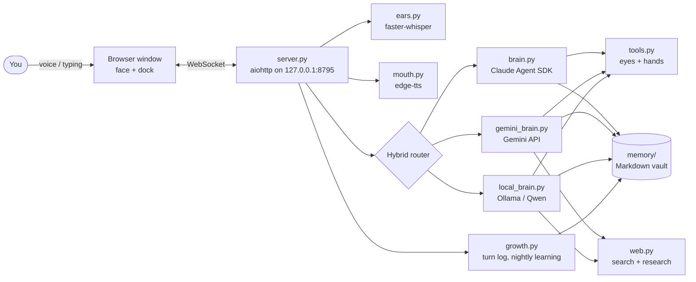

# Jarvis-Max

**A voice-first AI desktop assistant for Windows with seven swappable brains, eyes, hands, a memory, and a nightly self-improvement loop.**

You talk; Jarvis answers in a calm British voice. He can see your screen and webcam, click and type with your mouse and keyboard (only when you allow it), search and read the web, keep notes about you, and learn from his own mistakes overnight. He can run on Claude, on Gemini, or fully on your own PC with a local Qwen model, and you can switch brains at any time from a menu or just by asking.

Everything runs locally on `127.0.0.1`. The only things that leave your PC are the requests to whichever cloud brain you pick.

---

## Contents

- [Features](#features)
- [The seven brains](#the-seven-brains)
- [How it works](#how-it-works)
- [Requirements](#requirements)
- [Quick start](#quick-start)
- [Using Jarvis](#using-jarvis)
- [Self-improvement: how Jarvis learns every night](#self-improvement-how-jarvis-learns-every-night)
- [Configuration (`app/jarvis.json`)](#configuration-appjarvisjson)
- [Project layout](#project-layout)
- [Local API](#local-api)
- [Adding your own brain](#adding-your-own-brain)
- [Security and privacy](#security-and-privacy)
- [Known limitations](#known-limitations)
- [Credits and license](#credits-and-license)

---

## Features

| | What it does | Built with |
|---|---|---|
| **Brains** | Claude Sonnet / Opus / Haiku, Gemini / Gemini Flash-Lite, local Qwen, or Auto; switch from the BRAIN menu or by voice. Jarvis restarts the brain in-process and confirms which model actually came up. | Claude Agent SDK, Gemini API, Ollama |
| **Ears** | Push-to-talk (TALK / F2) or hands-free (LISTEN). Tuned for Indian-English accents with a hint prompt and a fix-list for commonly misheard names. | faster-whisper `large-v3-turbo` (CPU, int8), `small.en` fallback |
| **Voice** | Spoken replies, sentence by sentence, while the answer is still streaming. | edge-tts, `en-GB-RyanNeural` |
| **Eyes** | Screenshots, on-screen text with positions (OCR), and webcam pictures. | mss, Pillow, Tesseract (optional) |
| **Hands** | Click by the *words* on screen, click at coordinates, type, press key combos, scroll, open apps and URLs, list and focus windows. A HANDS switch turns them off; slamming the mouse into a screen corner stops any action. | pyautogui, pyperclip |
| **Web** | Search, read pages, multi-page research with sources, and *multi search* (one term across several engines, summarised). Web text is treated as data, never as instructions. | ddgs |
| **Memory** | A plain-Markdown vault: a boot file, one note per subject, and a daily log. The brains read and write it themselves. | `memory/` folder |
| **Growth** | Every request is logged with your thumbs-up or thumbs-down. Each night the local model writes lessons and skills, rewrites everything into one short contradiction-free list, and keeps the changes only if a test sheet scores the same or better. | `app/growth.py` |
| **Face + dock** | An animated full-screen face (four styles) with a one-click button dock underneath. | ai-visualizer by Jared Rhodenizer |

---

## The seven brains

| Menu entry | Runs on | Needs | Good for |
|---|---|---|---|
| **Claude Sonnet** | Claude Code via the Claude Agent SDK | A Claude plan (Pro / Max / Team / Enterprise) | Everyday default: fast and sharp |
| **Claude Opus** | Same | Same (uses more of your limit) | The hardest jobs |
| **Claude Haiku** | Same | Same (uses the least) | Quickest Claude replies |
| **Gemini** | Gemini API: the newest Gemini Flash your key can use | A free Gemini API key | A second cloud brain |
| **Gemini Flash-Lite** | Gemini API, `gemini-3.5-flash-lite` | Same key | The quickest Gemini; weaker at long multi-step jobs |
| **Local Qwen** | Ollama on your own PC, `qwen3.5:9b` | Ollama plus a GPU with enough memory for a 9B model | Free and private, works when your cloud limits run out |
| **Auto** | Claude first; falls back to Local Qwen for 30 minutes when your Claude limit runs out or Claude can't be reached | Claude plan + Ollama | Never being left without a brain |

The Claude entries use Claude Code's model aliases (`sonnet`, `opus`, `haiku`), so they always follow the newest model of each family that your plan allows. On startup Jarvis reads back the real model (for example "Claude Haiku 4.5") and says it out loud.

Every brain gets the same abilities: the Gemini and local brains share one tool set (web, screen, camera, hands, files, PowerShell, memory, `switch_brain`), and the Claude brain uses Claude Code's own tools plus the same eyes-and-hands tools over an in-process MCP server.

---

## How it works



- **One server, one window.** `server.py` serves the face, the dock and a WebSocket. Replies stream back word by word; each finished sentence is turned into speech in parallel, so Jarvis starts talking before he has finished thinking.
- **The router** (`Hybrid` in `local_brain.py`) sends each request to the brain chosen in `jarvis.json` and handles Auto's fallback.
- **Brains emit the same events** (`delta`, `sentence`, `tool`, `tool_result`, `error`), so the server doesn't care which one is answering.
- **Context control for the small models:** only the newest picture is kept, old tool results are trimmed, and after an action that changes the screen (click, type + Enter, open a URL) the local brain automatically reads the screen again so it can see what happened.

---

## Requirements

- **Windows 10 or 11, 64-bit.** The hands, OCR paths, launcher and window handling are Windows-specific.
- **A microphone.** A webcam is optional.
- **At least one brain:**
  - a **Claude plan** for the Claude brains (you sign in once in the browser, no API key), and/or
  - a **Gemini API key** from [Google AI Studio](https://aistudio.google.com/apikey) for the Gemini brains, and/or
  - **[Ollama](https://ollama.com)** with `ollama pull qwen3.5:9b` for the local brain.
- **Optional:** [Tesseract OCR](https://github.com/UB-Mannheim/tesseract/wiki) for reading on-screen text and clicking by label. Without it, Jarvis still sees the screen as a picture.

Python and every package are installed automatically by [uv](https://github.com/astral-sh/uv) on first start (Python 3.11 or 3.12).

---

## Quick start

1. Clone or download this repository.
2. Double-click **`Start-Jarvis-Max.bat`**.
   - The first start installs uv if needed, downloads Jarvis's parts (about 1 GB) and opens a Claude sign-in page. Later starts take seconds.
   - The speech model (about 1.6 GB) downloads in the background; a small model listens until it's ready.
3. Allow the microphone (and camera) when the window asks.
4. Say or type **"hello"**.

To use Gemini, pick it from the **BRAIN** menu and paste your key into the box that appears. To use the local brain, install Ollama, pull `qwen3.5:9b`, and pick **Local Qwen**.

Button-by-button instructions for non-technical users are in [`READ-ME-FIRST.txt`](READ-ME-FIRST.txt).

---

## Using Jarvis

| Control | Action |
|---|---|
| **TALK** / `F2` | Click, speak, click again. |
| **LISTEN** | Hands-free: Jarvis answers whenever you pause. |
| Type box + **SEND** | Type instead of speaking. |
| 👍 / 👎 | Mark the last answer right or wrong (type what was wrong first if you like). |
| **CAMERA** | Webcam on or off; while it's on, each question includes a picture. |
| **SCREEN** | "Look at my screen". |
| **SEARCH** | Web search for what's in the box. |
| **MEMORY** | Browse the notes Jarvis keeps. |
| **HANDS** | Allow or forbid mouse and keyboard control. |
| **VOICE** | Spoken replies on or off. |
| **LOG** | The conversation, **START A FRESH CONVERSATION**, and **LEARN NOW**. |
| **FACE** | Circuit Board, Radial, Face in the Code, Neural Core. |
| **BRAIN** | Choose one of the seven brains. |
| **STOP** / `Esc` | Stop at once, mid-sentence or mid-task. |

Things to say: *"switch to Opus"*, *"research the best budget GPU this year"*, *"multi search Ada Lovelace"*, *"open YouTube and search for lo-fi music"*, *"what's on my screen?"*, *"remember that my car is white"*.

---

## Self-improvement: how Jarvis learns every night

`app/growth.py` implements a small, safe improvement loop that runs on the free local model.

1. **Turn log.** Every request is appended to `logs/turns.jsonl`: which brain answered, the tools used (with the start of each result and an error flag), errors, and your verdict.
2. **Feedback.** The 👍/👎 buttons, or simply saying *"no, I meant…"*, *"wrong"* or *"galat"* (marks the previous answer wrong) and *"perfect"*, *"well done"* or *"shabash"* (marks it right).
3. **Nightly run** (between 1 and 6 am when Jarvis has been idle for 10 minutes, or any idle time if the last run was more than 36 hours ago; **LEARN NOW** runs it immediately):
   1. Back up every note, `Lessons.md` and `Skills.md` to `memory/.growth/archive/<date>/`.
   2. Score a **test sheet** of real requests (`memory/.growth/tests.json`): for each one, does the model pick the right first tool? Nothing is executed.
   3. **Lessons:** short imperative rules drawn from wrong, corrected or failed turns → `memory/notes/Lessons.md`.
   4. **Skills:** step-by-step recipes from multi-tool jobs that worked → `memory/notes/Skills.md`.
   5. **Consolidation:** all old and new lessons, and all old and new skills, are rewritten into one fresh short bullet list with duplicates merged; where two points contradict, the newer one wins. Notes that changed since the last run are rewritten as bullets that keep every fact. A rewrite that loses too much is rejected.
   6. **Re-score.** If the score dropped, yesterday's lessons and skills are restored.
   7. Requests you marked 👍 become new test questions.
   8. A report goes to `memory/.growth/reports/<date>.md`.
4. **Every brain reads the result:** lessons and skills are added to the system prompt of the Claude, Gemini and local brains.

---

## Building from GitHub and publishing to GitHub

`app/builder.py` gives every brain five tools: `project_start`, `project_next`, `project_ask`, `project_status` and `github_publish`.

**Build and install a GitHub project, pen-and-paper style:**

1. `project_start <link>` shows you the owner, stars, last update and license. With your ALLOW, it downloads the project into `Desktop\Jarvis-Builds\<name>`.
2. The **consultant** (Claude Sonnet through your Claude plan, or Gemini when Claude is unavailable) reads the README, the file list and the tools already on the PC. It writes `PLAN.md`: a checklist of PowerShell steps, each with a command that proves the step worked.
3. The brain on duty, even local Qwen, runs one step at a time with `project_next`. Each command needs your ALLOW. The full output goes to `.jarvis-logs/`, and the brain sees only the tail, so a small model never overflows.
4. When a step fails, `project_ask` sends the consultant the step, the error and the plan. The fix goes into the checklist, and the brain carries on. After three consultations on the same step it stops and tells you.

**Publish a folder to your GitHub** with `github_publish <folder> <repo>`:

1. A `.gitignore` is added that keeps out keys, `secrets/`, `memory/`, `logs/`, virtual environments and `node_modules`.
2. A safety scan blocks API keys, tokens, private keys, passwords and files over 50 MB.
3. The consultant writes a README if there isn't a proper one.
4. You see a preview (repo, public or private, file count, top-level files) and click ALLOW.
5. It pushes, never with force. If GitHub only holds its starter README or license, it merges that; otherwise it refuses to overwrite.
6. It confirms that GitHub shows the same commit.

New repos are created by you: Jarvis opens GitHub's new-repo page with the name filled in. Set `github_user` in `jarvis.json`.

---

## Configuration (`app/jarvis.json`)

| Key | Default | Meaning |
|---|---|---|
| `name` | `"JARVIS"` | Assistant name shown in the window. |
| `call_me` | `"Dr Wolf"` | What Jarvis calls you. **Change this to your own name.** |
| `port` | `8795` | Local port (bound to 127.0.0.1 only). |
| `face` | `"board"` | Starting face: `board`, `radial`, `rain`, `neural`. |
| `voice` / `voice_rate` | `"en-GB-RyanNeural"` / `"+0%"` | Any edge-tts voice and speed. |
| `brain_mode` | `"auto"` | `claude`, `gemini`, `local` or `auto`. Set by the BRAIN menu. |
| `model` | `"sonnet"` | Claude alias: `sonnet`, `opus` or `haiku`. |
| `gemini_model` | `"auto"` | `auto` = newest Gemini Flash your key can use, or an exact ID such as `gemini-3.5-flash-lite`. |
| `local_model` / `local_ctx` | `"qwen3.5:9b"` / `12288` | Ollama model and context size. |
| `ears_model` | `"large-v3-turbo"` | Any faster-whisper model name. |
| `search_region` | `"in-en"` | Web-search region (for example `us-en`, `uk-en`). |
| `github_user` | `""` | Your GitHub username, used by `github_publish`. |
| `hands_on_at_start` | `true` | Whether mouse and keyboard control starts enabled. |
| `open_window` | `true` | Open the window automatically on start. |

API keys are **not** stored here. The Gemini key lives in `secrets/gemini_key.txt`, which is git-ignored.

---

## Project layout

```
Jarvis-Max/
├─ Start-Jarvis-Max.bat   one-click launcher (installs uv, syncs deps, signs in, starts)
├─ READ-ME-FIRST.txt            plain-English user guide
├─ Jarvis-Max.md                this file
├─ memory-template/CLAUDE.md    boot file copied to memory/ on first start
├─ LICENSE, LICENSES/           AGPL-3.0 and third-party licenses
└─ app/
   ├─ server.py        aiohttp server, WebSocket, conversation loop, brain switching, API
   ├─ brain.py         Claude brain (Claude Agent SDK), permission gate, voice rules
   ├─ local_brain.py   local Qwen brain (Ollama), shared tool set, context fitting, Hybrid router
   ├─ gemini_brain.py  Gemini brain (REST + SSE, function calling), model auto-pick, busy fallback
   ├─ growth.py        turn log, feedback, nightly lessons/skills/consolidation, test sheet
   ├─ builder.py       GitHub builds (checklist + consultant) and safe publishing
   ├─ tools.py         eyes and hands (MCP tools): screen, OCR, camera, mouse, keyboard, apps, switch_brain
   ├─ web.py           search, page reading, research, multi search
   ├─ ears.py          speech-to-text (faster-whisper) with accent hints and name fixes
   ├─ mouth.py         text-to-speech (edge-tts)
   ├─ signin.py        first-run Claude sign-in
   ├─ common.py        paths, settings, the BRAINS table, secrets
   ├─ jarvis.json      settings
   ├─ pyproject.toml, uv.lock
   ├─ face/            animated face (ai-visualizer, AGPL-3.0)
   └─ dock/            button dock (dock.js, dock.css)
```

Created at runtime and git-ignored: `app/.venv/`, `models/` (speech models), `logs/`, `memory/` (your personal vault) and `secrets/`.

---

## Local API

All endpoints are on `http://127.0.0.1:8795`. Non-GET requests must come from the Jarvis window's own origin.

| Endpoint | Method | Purpose |
|---|---|---|
| `/ws` | WebSocket | Conversation: `ask`, `stop`, `hands`, `permission_reply`, `camera_frame`, `new_session`; receives `delta`, `say`, `tool`, `status`, `announce`… |
| `/api/status` | GET | Brain, ears, voice and hands status. |
| `/api/listen` | POST | Audio in, text out (speech-to-text). |
| `/api/brain` | GET / POST | List brains, or switch: `{"choice": "haiku"}`. |
| `/api/gemini_key` | POST | Save and validate a Gemini key. |
| `/api/feedback` | POST | `{"good": true/false, "note": "..."}` on the last answer. |
| `/api/grow` | POST | Run the learning cycle now. |
| `/api/memory`, `/api/memory/note` | GET | List and read notes. |

---

## Adding your own brain

A brain variant that uses an existing engine is one entry in `BRAINS` in `app/common.py`:

```python
"gemini-lite": {"label": "Gemini Flash-Lite", "brain_mode": "gemini",
                "gemini_model": "gemini-3.5-flash-lite",
                "about": "The quickest Gemini, same API key."},
```

Then add its id to the `switch_brain` enum in `app/tools.py` so it can be chosen by voice. The BRAIN menu builds itself from `BRAINS`.

A new engine (another API) is a class with `start()`, `restart()`, `stop()`, `interrupt()` and an async `ask(text, images)` that yields `("delta", text)`, `("sentence", text)`, `("tool", name, args)`, `("tool_result", name, text, is_error)` and `("error", message)`. Subclassing `LocalBrain` gives you the full tool set and tool runner for free, which is how `GeminiBrain` works. Register it in the `Hybrid` router and in `server.py`.

---

## Security and privacy

- **Local only:** the server binds to `127.0.0.1` and checks `Host` and `Origin` on every request.
- **Permission gate:** every PowerShell command, and every file write outside the memory folder, needs your click on **ALLOW**.
- **Prompt-injection hygiene:** web pages, screen text and documents are fed to the brains as data, and the brains are told never to follow instructions found there.
- **Hard rules in the boot file:** never type or store passwords, OTPs or card numbers; never pay, buy or create accounts.
- **Nothing personal in git:** `memory/`, `logs/`, `secrets/` and `models/` are git-ignored.
- **Hands kill switch:** move the mouse into any screen corner.

---

## Known limitations

- Windows only.
- The local 9B model and Gemini Flash-Lite are noticeably weaker than Claude at long mouse-and-keyboard jobs.
- The Gemini API free tier is rate-limited. A consumer Gemini subscription does not pay for API use.
- Clicking by label needs Tesseract installed.
- The nightly learning run needs Ollama running and takes a few minutes.

---

## Credits and license

- **Face:** [ai-visualizer](https://github.com/jaredrhod/ai-visualizer) by Jared Rhodenizer (AGPL-3.0)
- **Memory layout:** adapted from ai-memory-vault by Jared Rhodenizer (CC BY-SA 4.0)
- **Claude brains:** [Claude Agent SDK](https://docs.claude.com/en/docs/agent-sdk/overview) / Claude Code by Anthropic
- **Gemini brains:** [Gemini API](https://ai.google.dev/) by Google
- **Local brain:** [Ollama](https://ollama.com) + Qwen by Alibaba Cloud
- **Ears:** [faster-whisper](https://github.com/SYSTRAN/faster-whisper) (MIT)
- **Voice:** [edge-tts](https://github.com/rany2/edge-tts)
- **Web:** [ddgs](https://github.com/deedy5/ddgs)
- **Hands:** [PyAutoGUI](https://github.com/asweigart/pyautogui)

Jarvis-Max includes AGPL-3.0 code (the face), so the project as a whole is released under the **GNU Affero General Public License v3.0**; see [`LICENSE`](LICENSE). Third-party license texts are in [`LICENSES/`](LICENSES/).

Built by **[Sh4nkR](https://github.com/Sh4nkR)**, with Claude as the engineer.
