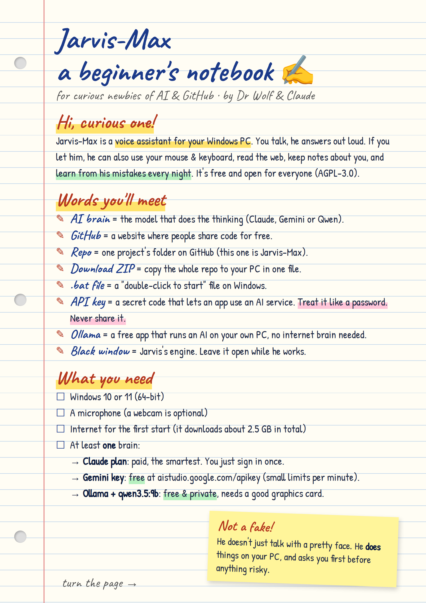
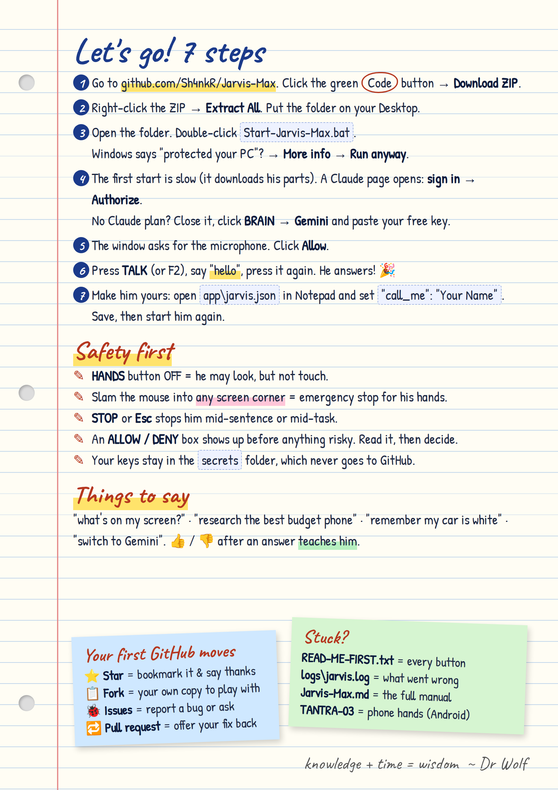

# New to AI and GitHub? Start here ✍

A two-page, hand-written-style notebook that takes you from "what's a repo?" to talking with Jarvis.
Prefer to print it? Download the [PDF](docs/Newbie-Notebook.pdf).

## The same notes in plain text

**What you need:** Windows 10 or 11 (64-bit), a microphone, internet for the first start (about 2.5 GB), and at least one brain:
a Claude plan (paid, sign in once), a free Gemini key from [aistudio.google.com/apikey](https://aistudio.google.com/apikey), or free [Ollama](https://ollama.com) with `qwen3.5:9b` (needs a good graphics card).

**7 steps**
1. On this page, click the green **Code** button → **Download ZIP**.
2. Right-click the ZIP → **Extract All**, onto your Desktop.
3. Double-click `Start-Jarvis-Max.bat`. If Windows says "protected your PC": **More info → Run anyway**.
4. First start is slow (it downloads his parts). A Claude page opens: **sign in → Authorize**. No Claude plan? Close it, then **BRAIN → Gemini** and paste your free key.
5. Allow the microphone.
6. Press **TALK** (or F2), say "hello", press again.
7. Make him yours: in `app\jarvis.json` set `"call_me": "Your Name"`, save, start him again.

**Safety:** HANDS off = look, don't touch · mouse into any screen corner = emergency stop · STOP or Esc stops everything · an ALLOW/DENY box comes before anything risky · keys live in `secrets/`, which never goes to GitHub.

**Stuck?** [READ-ME-FIRST.txt](READ-ME-FIRST.txt) explains every button · `logs\jarvis.log` shows what went wrong · [Jarvis-Max.md](Jarvis-Max.md) is the full manual · [TANTRA-03](TANTRA-03-hands-only-app.md) covers the Android phone hands.

*knowledge + time = wisdom* ~ Dr Wolf
